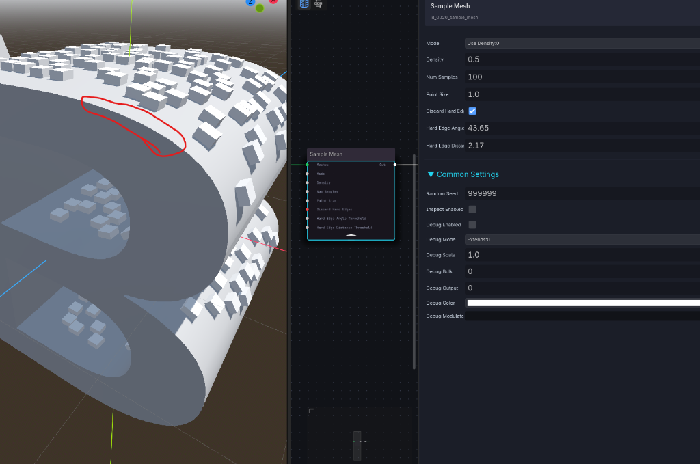
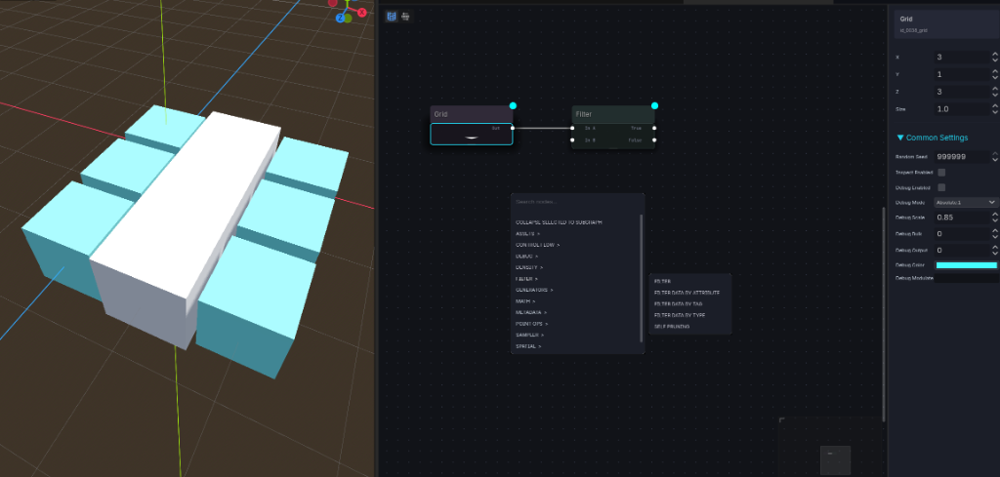
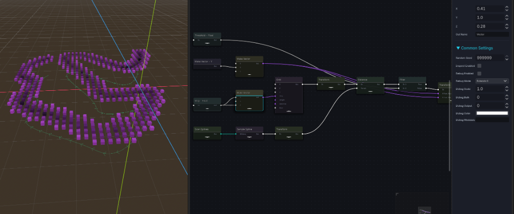
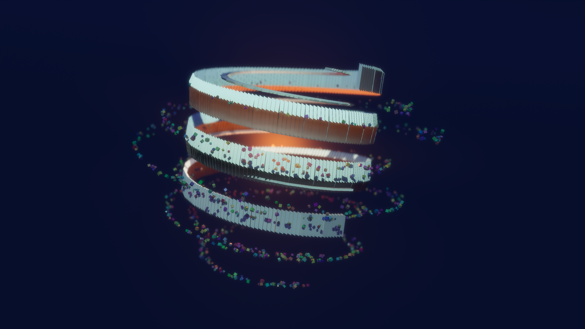
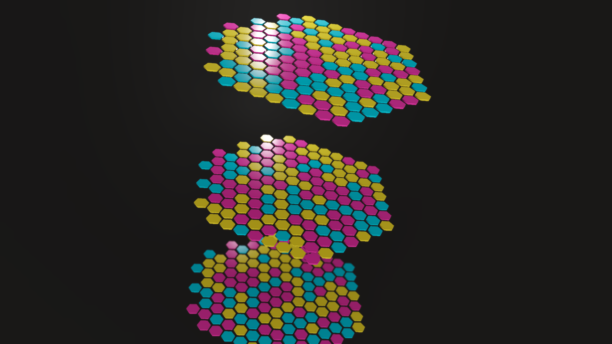

# PCGODOT (Flow Graph)

[](https://godotengine.org)
[](#)

**PCGODOT** is a highly powerful, node-based Procedural Content Generation (PCG) framework for Godot 4.6+, heavily inspired by **Unreal Engine 5's PCG**. It enables developers to construct intricate point-set distributions, manipulate spatial attributes, and spawn meshes, lights, or scene hierarchies procedurally using a visual flow graph editor inside Godot.

---

## 🎨 Gallery & Showcases

### 1. Sampling Meshes (Discarding Hard Edges)
Distribute points across the faces of a 3D Mesh while pruning points near hard edges.


### 2. Random Subscenes Distribution (Forests & Paths)
Distribute different subscenes randomly along curves and paths using attributes, custom rotation-alignment filters, and scene scanners.


### 3. Unified Filters & Category Popup
Browse nodes structured into standardized categories matching Unreal PCG. Select filters such as `Filter Data by Attribute`, `Filter Data by Tag`, and `Filter Data by Type`.


### 4. Proximity Sampling & Distance to Density
Sample points and scale their density values smoothly based on their distance/proximity to curves or splines.


### 5. Nested Subgraphs & Selection Collapse
Create nested graphs and easily collapse selected nodes into a reusable Subgraph.


### 6. Procedural Helical Colonnade & Rubble Scatter
Generate complex procedural architecture such as helical towers. Combines curve sampling with coordinate transforms, relative lintel placement, and duplicate scatter operations to create debris and rubble.


### 7. Fall Guys Hexagons
Generate dynamic gameplay platforms such as the multi-colored hexagon grid inspired by Fall Guys. Use the **Random Color** node to assign random color attributes from a palette to a MultiMesh.


---

## 🚀 Key Features

* **Unreal Engine PCG Alignment (1:1)**: Unified categories, names, and logic schemas conforming to the Unreal PCG specifications.
* **+110 Nodes**: A robust library of nodes for spatial, attribute, and asset generation. Check out the full [PCGODOT Node Library Reference](demo/addons/flow_nodes_editor/doc/nodes_reference.md).
* **Interactive 3D Viewport Debugging**: Toggle 3D visualizations showing point positions, density gradients, scale, and rotations directly in Godot's editor.
* **Searchable Data Inspector**: Spreadsheet/table inspector showcasing attributes at any node, with active highlighting linked back to the 3D viewport.
* **Subgraphs & Loops**: Nest graphs with local parameters, custom outputs, and feedback loops.
* **Core Tagging Support**: A dedicated `tags` property (`PackedStringArray`) inside data elements for tag-based filtering.
* **Copy/Paste**: Import/export graph components instantly as JSON.
* **Auto-Reload Pipeline**: Automatically monitors filesystem changes, invalidates caches, and hot-reloads graphs in the editor.

---

## 🔍 Interactive Debugging & Analysis Modes

PCGODOT features interactive inspection utilities to debug procedural logic without compiling your game.

### 1. 3D Editor Debug View (Press `D`)
Select any node in the graph and press **`D`** (or toggle `debug_enabled` in the Inspector) to visualize generated points directly inside Godot's 3D viewport:
* **Debug Mode**: Toggle between `EXTENDS` (uses the point's actual bounds/scale) and `ABSOLUTE` (renders uniform debug cubes scaled by `debug_scale`).
* **Modulate Color**: Modulate debug colors dynamically by typing an attribute name (e.g. `density` or `color`) in the **Debug Modulate By** setting.
* **Debug Port Selector**: Pick which output port/data bulk to draw.

### 2. Searchable Data Inspector (Press `E`)
Press **`E`** (or select a node and click Inspect) to open the bottom **Data Inspector** spreadsheet:
* View a real-time, spreadsheet view of all point attributes (coordinates, rotations, scales, weights, and tags).
* **Attribute Filtering**: Search and filter points instantly using the filter bar (e.g., search for specific tags or range numbers).
* **Cross-Highlighting**: Click any row in the spreadsheet, and the matching point in the 3D viewport will highlight in Magenta and scale up, making it trivial to find which point matches which database row.

---

## 📂 Node Library Reference

PCGODOT organizes nodes according to the official Unreal Engine PCG structure, expanded with custom Godot helpers. For detailed documentation on what each node does and to view their source code, see the **[PCGODOT Node Library Reference](demo/addons/flow_nodes_editor/doc/nodes_reference.md)**.

### 📁 Category Overview:
1. **Subgraphs & Control Flow**: Nested subgraphs (`subgraph.gd`), loops (`loop.gd`), inputs/outputs, branches, select nodes, and conditional switches.
2. **Metadata & Attributes**: Add/remove attributes, rename streams, filter attribute ranges, and manipulate tag collections.
3. **Math & Logic Ops**: Standard math operations (`math_op.gd`), curve/density remapping, custom expression parser (`expression.gd`), and aggregate reductions.
4. **Splines & Paths**: Sample spline paths, generate splines from point arrays, calculate distance gradients, and clip points by boundary polygons.
5. **Point Transformations**: Move, rotate, scale, and snap points to grid boundaries, prune overlaps (`self_pruning.gd`), or apply Lloyd relaxation.
6. **Assets & Spawning**: Spawn MultiMeshes, scene instances (`spawn_scenes.gd`), lights/GI nodes (`spawn_nodes.gd`), or apply point data properties to actors.
7. **Spatial & Physics Queries**: Perform spatial difference/intersection/union operations, trace raycasts, or check for physics collisions.
8. **Generators & Grid Nodes**: Draw coordinate grids, extract edge/corner boundaries, generate simplex noise, and build room-carving layouts.

---

## 🛠️ Setup & Installation

1. Copy the following folders from this repository into your Godot project's root:
   * `demo/addons/flow_nodes_editor`
   * `demo/bin`
2. Open your project in Godot: **Project** → **Project Settings** → **Plugins**.
3. Locate **Flow Nodes Editor** and toggle the status to **Enabled**.

---

## 🎮 Quickstart Guide

In a 3D Scene:
1. Create a `FlowGraphNode3D` node.
2. In the bottom dock panel, select the **Data Flow** workspace (appears when the node is selected).
3. Press **Shift+A** (or **Right-click**) inside the graph to open the **Add Node** search panel.
4. Add a generator like **Grid**, then connect it to **Spawn Scenes** or **Spawn Meshes**.
5. Press **D** on a selected node to toggle its 3D debug visualizer.
6. Press **E** to toggle the bottom **Data Inspector** spreadsheet.

---

## 🏗️ Building from Sources

If you want to compile the C++ wrappers (KdTree, RTree) yourself:

```bash
git submodule update --init
scons
```
Precompiled binaries for Windows and macOS are included under `demo/bin/` by default.

---

## 📄 License
This project is licensed under the MIT License. Feel free to adapt and expand it!
